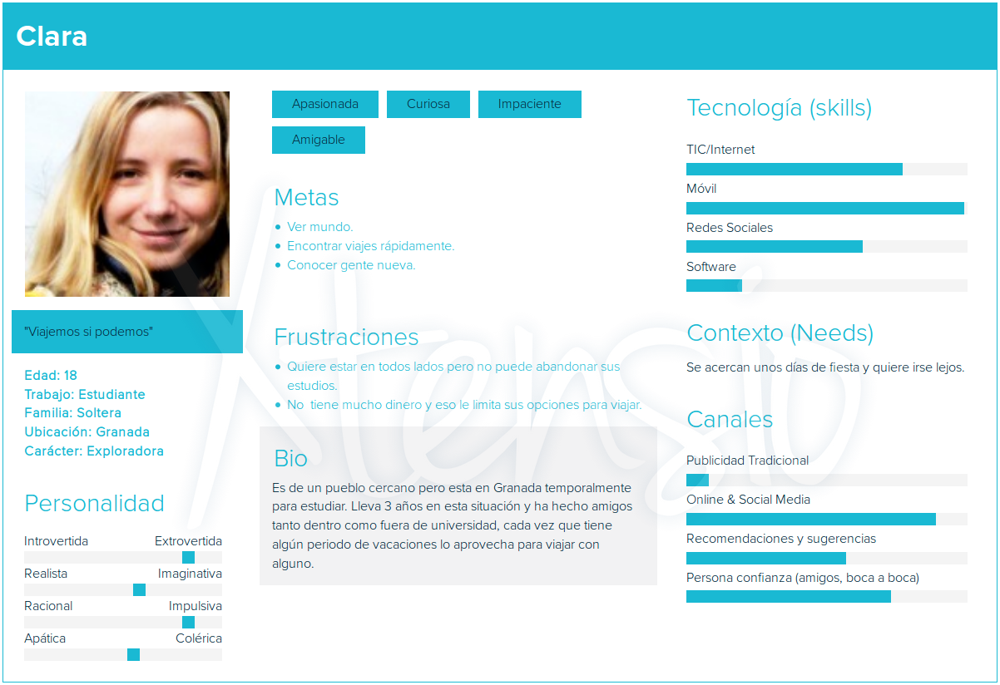
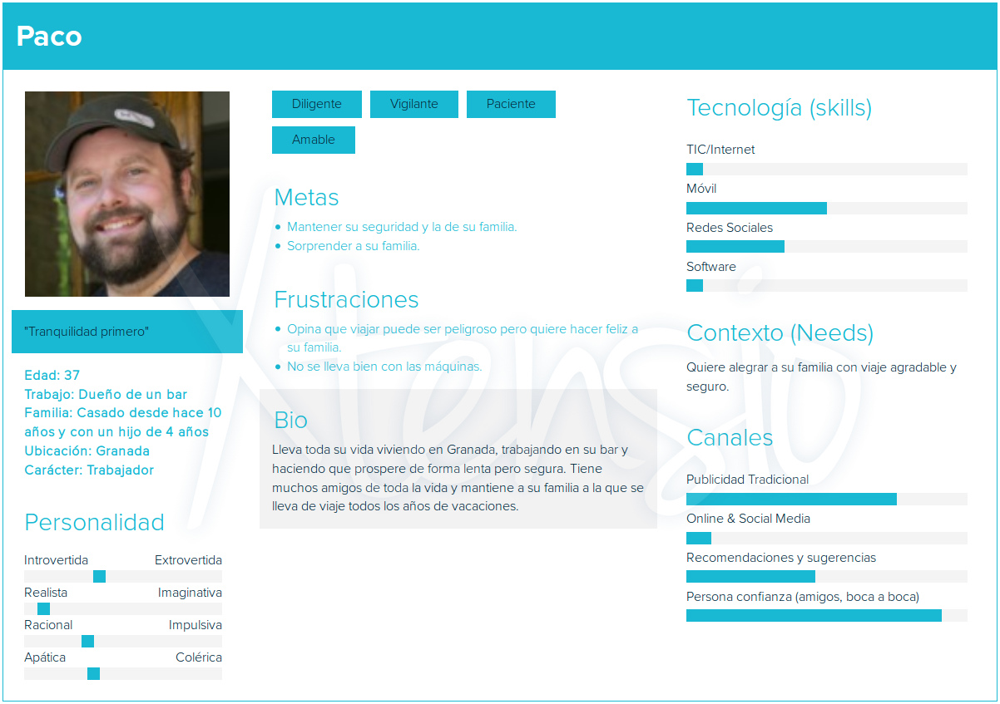
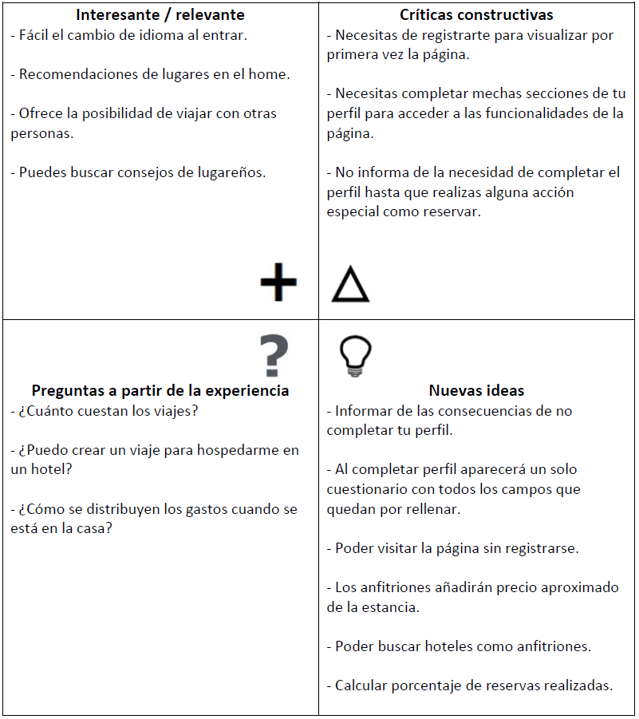

# DIU20
Prácticas Diseño Interfaces de Usuario 2019-20 (Economía Colaborativa) 

Grupo: DIU1_JoDa.  Curso: 2019/20 

Proyecto: 

Descripción:

Logotipo: 

Miembros
 * :bust_in_silhouette:   Jose Melguizo Ruano     :octocat:     
 * :bust_in_silhouette:  Daniel Arévalo Pérez     :octocat:

----- 

# Proceso de Diseño 

## Paso 1. UX Desk Research & Analisis 

 1.a Competitive Analysis
-----

Couchsurfing: De entrada parece una web normal de reserva de viajes, pero ya el nombre nos sugiere algo más acogedor, algo que nos ha llamado la atención. El hecho de buscar anfitriones, gente con la que quedar en un destino, etc. Todo esto nos pareció en un principio una forma innovadora de realizar viajes.

 1.b Persona
-----

Clara: Representa al público joven que es el principal target de este tipo de aplicación.

Paco: Representa a un sector distinto que tiene mayores dificultades con estos medios.

 1.c User Journey Map
----

Clara: Comprobar su funcionamiento con el público objetivo, algo muy habitual pues es hacia quien se dirige.

Paco: Muestra un caso con dificultades con el objetivo de encontrar posibles mejoras.

 1.d Usability Review
----

- Revisión de usabilidad completa: https://github.com/JoseMR6/DIU20/blob/master/P1/usabilidad_v2.pdf

- Valoración final: 83 / 100

Tiene muchos puntos positivos visualmente y para usuarios avanzados pero es duro con novatos por tareas iniciales de perfil necesarias.

## Paso 2. UX Design  

 2.a Feedback Capture Grid
----

Consistirá en una página web de viajes compartidos, mantendrá alguna de las cualidades positivas de la web que analizamos pero evitando el obvio problema que tenía con los usuarios nuevos.

 2.b Tasks & Sitemap 
-----

>>> Definir "User Map" y "Task Flow" ... 

 2.c Labelling 
----

>>> Identificar términos para diálogo con usuario  

Término | Significado     
| ------------- | -------
  Login¿?  | acceder a plataforma

 2.d Wireframes
-----

>>> Plantear el  diseño del layout para Web/movil (organización y simulación ) 

## Paso 3. Make (Prototyping) 

 3.a Moodboard
-----

>>> Plantear Diseño visual con una guía de estilos visual (moodboard) 

  3.b Landing Page
----

>>> Plantear Landing Page 

 3.c Guidelines
----

>>> Estudio de Guidelines y Patrones IU a usar 

  3.d Mockup
----

>>> Layout: Mockup / prototipo HTML  (que permita simular tareas con estilo de IU seleccionado)

## Paso 4. UX Check (Usability Testing) 

 4.a A/B Testing
----

>>> Comprobacion de asignaciones para A/B Testing. Asignaciones https://github.com/mgea/DIU19/blob/master/ABtesting.md

>>>> Práctica A: 

 4.b User Testing
----

>>> Usuarios para evaluar prácticas 

| Usuarios | Sexo/Edad     | Ocupación   |  Exp.TIC    | Personalidad | Plataforma | TestA/B
| ------------- | -------- | ----------- | ----------- | -----------  | ---------- | ----
| User1's name  | H / 18   | Estudiante  | Media       | Introvertido | Web.       | A 
| User2's name  | H / 18   | Estudiante  | Media       | Timido       | Web        | A 
| User3's name  | M / 35   | Abogado     | Baja        | Emocional    | móvil      | B 
| User4's name  | H / 18   | Estudiante  | Media       | Racional     | Web        | B 

. 4.c Cuestionario SUS
----

>>> Usaremos el **Cuestionario SUS** para valorar la satisfacción de cada usuario con el diseño (A/B) realizado. Para ello usamos la [hoja de cálculo](https://github.com/mgea/DIU19/blob/master/Cuestionario%20SUS%20DIU.xlsx) para calcular resultados sigiendo las pautas para usar la escala SUS e interpretar los resultados
http://usabilitygeek.com/how-to-use-the-system-usability-scale-sus-to-evaluate-the-usability-of-your-website/)
Para más información, consultar aquí sobre la [metodología SUS](https://cui.unige.ch/isi/icle-wiki/_media/ipm:test-suschapt.pdf)

>>> Adjuntar captura de imagen con los resultados + Valoración personal 

 4.c Usability Report
----

>> Añadir report de usabilidad para práctica B 

## Paso 5. Evaluación de Accesibilidad  

  5.a Accesibility evaluation Report
----

>>> Indica qué pretendes evaluar (de accesibilidad) y qué resultados has obtenido + Valoración personal

>>> Evaluación de la Accesibilidad (con simuladores o verificación de WACG) 

## Conclusión / Valoración de las prácticas

>>> (90-150 caracteres) Opinión del proceso de desarrollo de diseño siguiendo metodología UX y valoración (positiva /negativa) de los resultados obtenidos  

