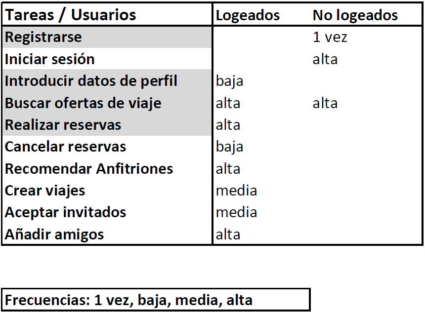
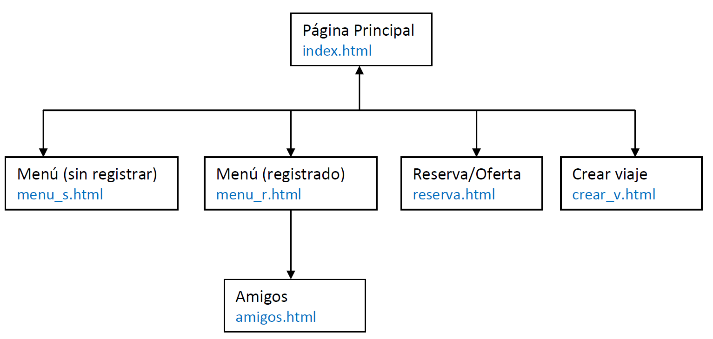
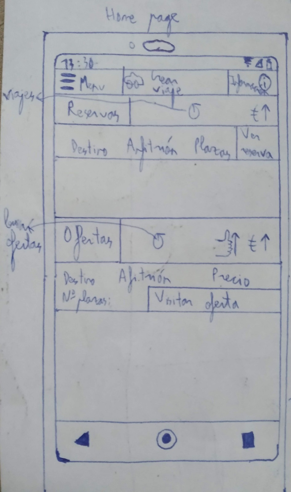
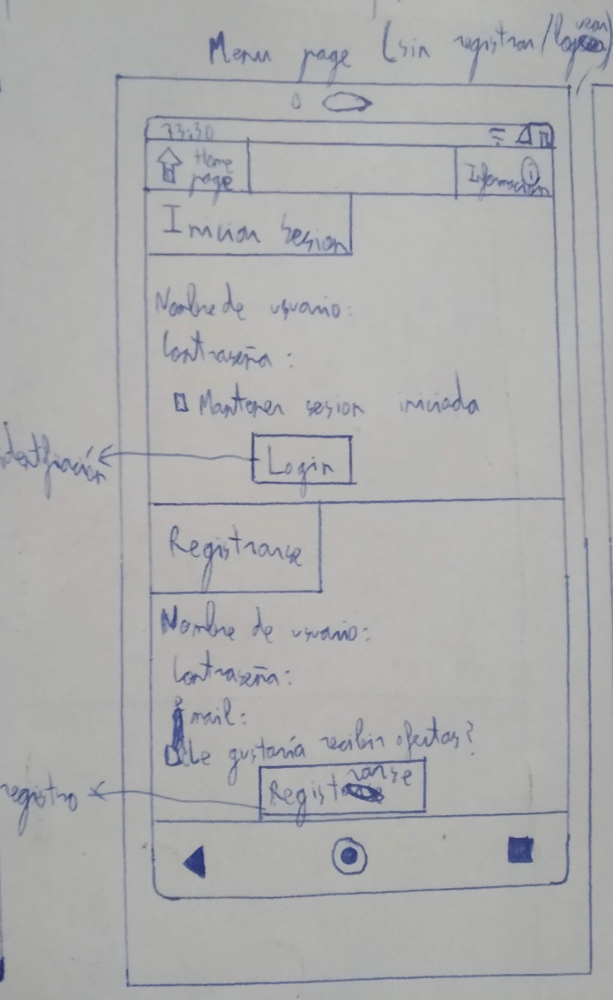
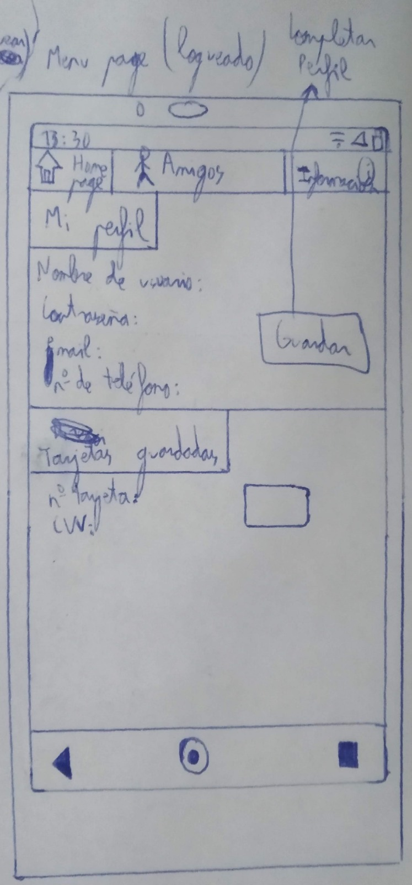
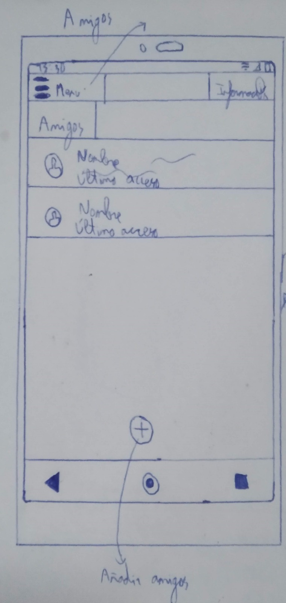
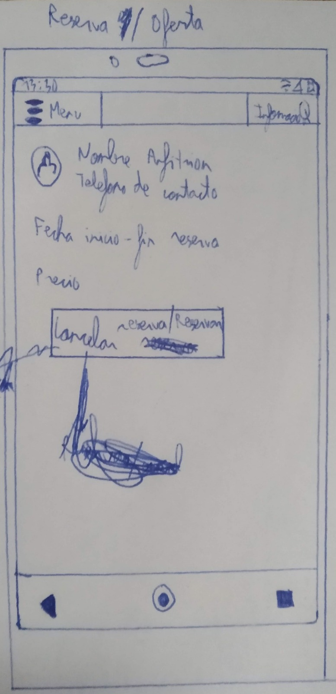
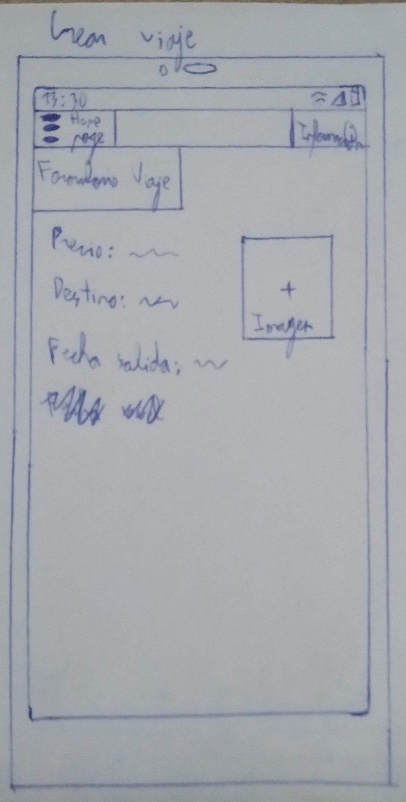

# DIU20
Prácticas Diseño Interfaces de Usuario 2019-20 (Economía Colaborativa) 

Grupo: DIU1_JoDa.  Curso: 2019/20 

Proyecto: TravelForce

Descripción: La web de viajes que facilita la vida a los nuevos viajeros.

Logotipo: 

Miembros
 * :bust_in_silhouette:   Jose Melguizo Ruano     :octocat:     
 * :bust_in_silhouette:  Daniel Arévalo Pérez     :octocat:

----- 

(Aclaración: cuando se dice usuarios novatos o avanzados no se hace referencia a sus conocimientos sobre informática sino a su tiempo de uso de la página y como de familiaizados estan con la página en particular.)

# Proceso de Diseño 

## Paso 1. UX Desk Research & Analisis 

 1.a Competitive Analysis
-----

Couchsurfing: De entrada parece una web normal de reserva de viajes, pero ya el nombre nos sugiere algo más acogedor, algo que nos ha llamado la atención. El hecho de buscar anfitriones, gente con la que quedar en un destino, etc. Todo esto nos pareció en un principio una forma innovadora de realizar viajes.

 1.b Persona
-----

Clara: Representa al público joven que es el principal target de este tipo de aplicación.

Paco: Representa a un sector distinto que tiene mayores dificultades con estos medios.

 1.c User Journey Map
----

Clara: Comprobar su funcionamiento con el público objetivo, algo muy habitual pues es hacia quien se dirige.

Paco: Muestra un caso con dificultades con el objetivo de encontrar posibles mejoras.

 1.d Usability Review
----

- Revisión de usabilidad completa: https://github.com/JoseMR6/DIU20/blob/master/P1/usabilidad_v2.pdf

- Valoración final: 83 / 100

Tiene muchos puntos positivos visualmente y para usuarios avanzados pero es duro con novatos por tareas iniciales de perfil necesarias.

## Paso 2. UX Design  

 2.a Feedback Capture Grid
----

Consistirá en una página web de viajes compartidos, mantendrá alguna de las cualidades positivas de la web que analizamos pero evitando el obvio problema que tenía con los usuarios nuevos.

 2.b Tasks & Sitemap 
-----

User/Task matrix

Hemos elegido esta técnica porque deja más claras las prioridades de las tareas, esto permite identificar más fácilmente a cual debemos dedicar más tiempo para asegurar su correcto funcionamiento.

Sitemap

 2.c Labelling 
----

Término | Significado     
| ------------- | -------
  Identificarme  | acceder a la plataforma
  Registrarme  | crear una cuenta en la plataforma
  Completar mis datos  | completar datos de la cuenta
  Buscar ofertas de viaje  | buscar un viaje entre los disponibles
  Hacer reserva  | confirmar viaje
  Mis viajes  | comprobar viajes pendientes
  Cancelar reserva  | cancelar viaje
  Datos de anfitrión  | conocer al futuro anfitrión
  Recomendar anfitrión  | marcar que es un buen anfitrión
  Añadir Amigo  | incluir usuario en la lista de amigos
  Crear Viaje  | preparar un viaje en el que otras personas pueden acoplarse
  Aceptar invitados  | indicar que estas dispuesto a acoger gente en tu casa

 2.d Wireframes
-----

Boceto de index.html

Boceto de menu_s.html

Boceto de menu_r.html

Boceto de amigos.html

Boceto de reserva.html

Boceto de crear_v.html

## Paso 3. Mi equipo UX-Case Study

 3.a ¿Como se cuenta un UX-Case Study?
-----

Resumen

Comienza planteando una pregunta sobre la que centrar el proyecto que pueda dar interés y realizando una investigación sobre el comportamiento de los usuarios para ver lo que deben trabajar en su aplicación para que sea atractiva además de investigar otras aplicaciones ya existentes similares.

Crean un par de personas, un journey map y algunos escenarios más para encontrar problemas que solucionar, se declara el problema principal y se crea un user flow y se comienzan con los bocetos iniciales.

Una vez comenzada la fase de diseño deciden que funciones priorizar y hacen los primeros wireframes a papel además de explicar el enfoque que han tomado. Tras esto se hacen los primeros test con usuarios y se van rediseñando y haciendo más test hasta que tienen algo más sólido. Entonces crean el sitemap, presentan la guía de estilos y crean las maquetas finales.

Crítica

Puntos positivos:

Remarcan bien el problema al que se enfrentan y los objetivos, fue un acierto usar al usuario para evaluar la aplicación cuando estaban en los primeros bocetos y no desarrollarlos demasiados en caso de problemas serios, la priorización de funciones fue apropiada a falta de una task matrix, investigar como el público interacciona con el arte les ayudó en el proceso de identificar problemas y objetivos.

Sobre todo el test de usuarios temprano  ha sido un punto de inflexión positivo pues permitió cambiar el rumbo del diseño a tiempo en lugar de desarrollar demasiado una propuesta que no atraería a los usuarios para luego tener que descartarla.

Puntos negativos:

Desarrolla poco el caso en torno a una de sus personas, el site map se desarrolla demasiado tarde, deberían haber hecho algo del mismo antes, podrían haber desarrollado algo los otros escenarios que propusieron.

  3.b Logotipo
----

La imagen creada para el logotipo ha sido adaptada usando paint, la resolución es la necesaria para mantener la calidad de la imagen y que no se pixele, Esta imagen podría ser usada como cabecera en twiter  haciendo algunos recortes, siempre teniendo en cuenta que la cabeza es la zona principal y más importante de la imagen.

 3.c Guidelines
----

Pautas útiles a seguir si es posible:
- Los botones de acción serán más grandes que el texto estándar y entre ellos serán mas grandes los  de mayor importancia.
- Vigilar la colocación de botones en lugares destacados.
- Utilizar los espacios en blanco para agrupar elementos posicionando cerca aquellos relacionados.
- Utilizar el contraste de color para marcar botones.
- Mostrar acciones secundarias junto a opción primaria.
- Cuadro de búsqueda claramente visible y fácilmente reconocible.
- Hacer que los enlaces de texto se destaquen.
- Usar iconos para acompañar a enlaces de Leer más.
- El usuario debe tener fácil acceso a la caja de búsqueda.
- Los filtros aplicados deben verse de manera fácil.
- Se debe de separar bien cada posible resultado.
- Se debe de poder re-ordenar de manera clara y sencilla.
- Incluir una opción para aumentar los resultados.
- Permitir que los usuarios puedan volver atrás en un paso.
- Permitir que el usuario pueda cambiar el lugar fácilmente de forma manual.
- Permitir realizar transiciones entre las aplicaciones para dispositivos móviles y la Web móvil sin inconvenientes.
- Incluir el campo de búsqueda en una posición destacada.
- Usar un método de indexación de búsqueda eficaz.
- Permitir ver y filtrar las opiniones de los usuarios.
- Ofrecer una utilidad clara antes de solicitar a los usuarios que se registren.
- Hacer que la autenticación de contraseñas sea una experiencia sin inconvenientes.
- Elaborar formularios fáciles de completar.
- Informar los errores del formulario en tiempo real.
- Usar el mismo vocabulario que los usuarios de su aplicación.
- Proporcione etiquetas de texto y teclas visuales para clarificar la información visual.
- Solicite permisos en un contexto relevante.

Tipo de letra:
Aller (Sans Serif).

Colores:
- Principal: Verde.
- Resaltar algunas cosas: Marrón.
- Fondo: Blanco.

Iconos:
- Home page 		https://fontawesome.com/icons/home?style=solid
- Menu 			https://fontawesome.com/icons/bars?style=solid
- Informacion 		https://fontawesome.com/icons/question-circle?style=regular
- Añadir amigos		https://fontawesome.com/icons/user-plus?style=solid
- Tarjetas		https://fontawesome.com/icons/credit-card?style=regular
- Personas 		https://fontawesome.com/icons/user?style=solid
- Refresh		https://fontawesome.com/icons/redo?style=solid
- Crear viaje (coche)	https://fontawesome.com/icons/car-side?style=solid

  3.d Video
----

https://youtu.be/c8_gk2HjHIY

## Paso 4. Evaluación 

 4.a Casos asignados
----

Caso 1:

Grupo DIU1.LEJIA, compuesto por Luis Escobar Reche y Jose Armando Albarado Mamani, forman parte del conjunto encargado del Tema "Experiencia de compartir viaje".

Enlace a github:
https://github.com/luiser1996/DIU20

Caso 2

Grupo DIU2.Mango, compuesto por Jose Luis Gallego Peña, forma parte del conjunto encargado del Tema "Experiencia de compartir alojamiento".

Enlace a github:
https://github.com/Dunspa/DIU20

Caso 3

Grupo DIU3.JoinsTheBattle, compuesto por Alessandro Rinaldi Gómez  y Germán Castilla López, forman parte del conjunto encargado del Tema "Experiencia de compartir ocio". 

Enlace a github:
https://github.com/ralesdi/DIU20

 4.b User Testing
----

Paco en el caso 1 si quisiera ver sus reservas, por ejemplo, al estar el menú al final de la página, si hay más información de la que cabe en el largo del móvil y hay que desplazar la ventana para verlo, no sería capaz de ver el menú y no podría utilizarlo.

Si Paco, en el caso 2, después de haberse registrado crea una publicación de habitación y no hace nada más tendrá el perfil en privado que parece que es como está por defecto y los usuarios al visitar la habitación no podrían ver su perfil y no creo que vayan a optar por esa elección. Aunque es cierto que lo quisiese así, lo normal de Paco es no fijarse en esos detallitos y estaría bien que recibiera una notificación o algo.

Clara, en el caso 3, se encuentra ante la realización del pago de la actividad pero en ese momento se decanta por la otra actividad que previamente había visto pero no había seleccionado por si encontraba una mejor y quiere volver hacia atrás en la página pero no hay botón dentro de la página y ya está en el método de pago por lo cual no quiere usar el botón del navegador, tendría que volver a buscar por tanto las actividades desde el principio.

. 4.c Ranking
----

Se puede ver que ha habido mucha confusión en la practica 3 pues ninguno coincide completamente con el formato de la misma, sobre todo en el readme principal nadie lo ha adaptado, esto probablemente se debe a que se han cambiado las practicas que estaban planeadas en mitad del semestre. Los bocetos eran todos muy buenos, quedan mejor hechos en el ordenador.

En general todo lo entregado ha estado bien, la principal diferencia de puntos se basa en las secciones faltantes, el resto de puntos perdidos ha sido por detalles como no respetar límites de caracteres y duracines.

Ranking:
1. DIU1.LEJIA 84.
2. DIU3.JoinsTheBattle 83.
3. DIU2.Mango 77.

## Paso 5. Evaluación de Accesibilidad  

  5.a Accesibility evaluation Report
----

>>> Indica qué pretendes evaluar (de accesibilidad) y qué resultados has obtenido + Valoración personal

>>> Evaluación de la Accesibilidad (con simuladores o verificación de WACG) 

## Conclusión / Valoración de las prácticas

>>> (90-150 caracteres) Opinión del proceso de desarrollo de diseño siguiendo metodología UX y valoración (positiva /negativa) de los resultados obtenidos  
